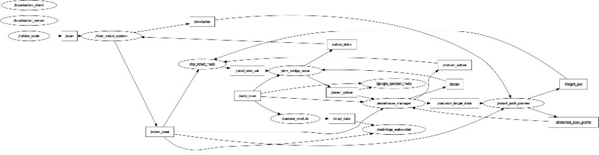
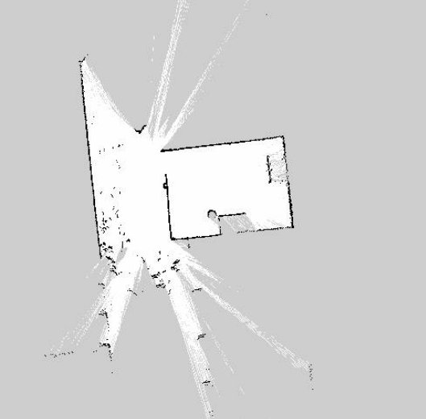
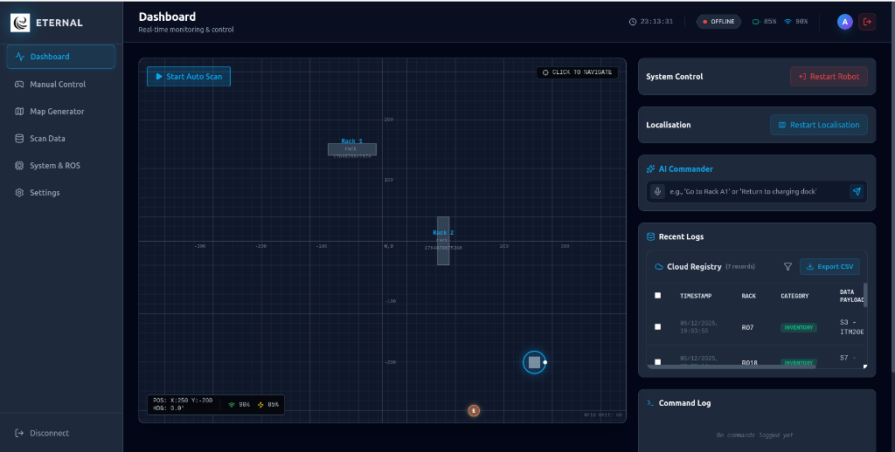
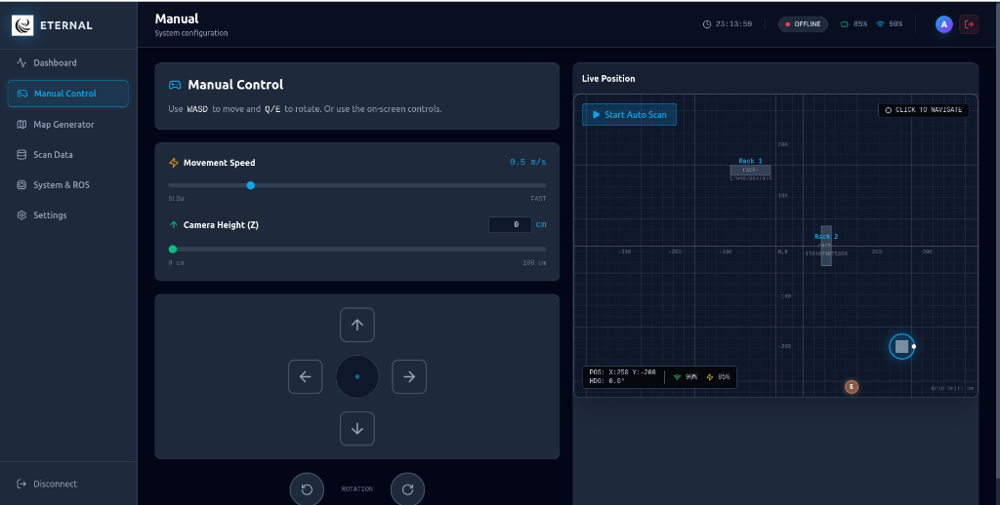
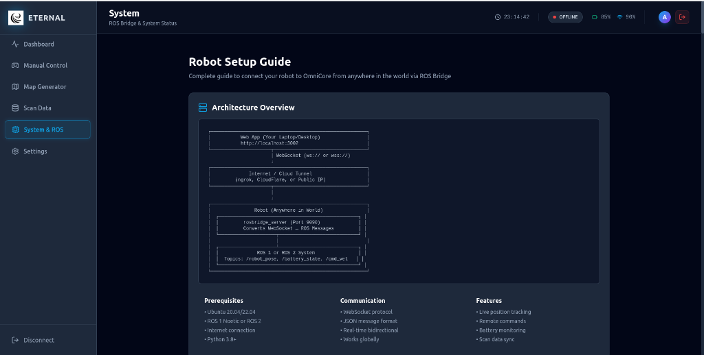

# WareHouse Automation Team 54

This repository contains the complete autonomous stack for Warehouse Inventory Scanning through qr codes. It is designed for scanning racks and QR codes in a warehouse environment, featuring a fully autonomous robot with a 4-Wheel mechannum design for omni-motion. The system includes modules for navigation, scanning, HMI, and robot bringup.

## Repository Structure

The workspace is organized into the following main packages:

-   **`warehouse_robot_bringup`**: The main entry point for the system. It contains launch files (`system.launch.py`) to start all necessary nodes and configure the environment.
-   **`warehouse_navigation`**: Contains the core logic for motion planning and control and slam.
    -   `mission_planner`: Implements the path planning and control logic.
    -   `SLAM`: SLAM implementation (standard ros 2 package).
-   **`warehouse_scanning`**: Responsible for detecting and decoding QR codes or barcodes. It processes camera data and logs results to `qr_session_logs` and also sends to the HMI.
-   **`warehouse_hmi`**: Provides a user interface (HMI) for interacting with the robot, monitoring its status, and sending commands.
-   **`warehouse_msgs`**: Defines custom ROS 2 messages and services used for communication between the different packages in this workspace.

## System Architecture

The following diagram illustrates the software architecture and data flow between the various ROS 2 nodes and modules in the system.



## File Descriptions

Here is a brief overview of the key files in this repository:

-   **`src/warehouse_navigation/mission_planner/mission_planner/vision.py`**: Handles LiDAR-based localization through genetic.cpp and contains the odometry fusion logic.
-   **`src/warehouse_navigation/mission_planner/mission_planner/path_planner.py`**: A smart path planner that generates collision-free dynamic paths for the robot, respecting rack and path constraints and dynamically avoiding obstacles.
-   **`src/warehouse_navigation/mission_planner/src/genetic.cpp`**: Implements a genetic algorithm to solve localisation by fitting the lidar map using genetic algorithm.
-   **`src/warehouse_robot_bringup/warehouse_robot_bringup/hardware.py`**: Interfaces with the STM32 microcontroller via serial to handle odometry, IMU data, and motor control commands acting as the primary interface between hardware and software.
-   **`src/warehouse_robot_bringup/warehouse_robot_bringup/main.py`**: The central state machine (`WarehouseManager`) that coordinates the robot's actions, managing rack sequences, scanning states, and navigation goals.
-   **`src/warehouse_hmi/warehouse_hmi/speaker_module.py`**: Manages text-to-speech functionality using Google TTS, providing audio feedback for robot status and actions.

## Requirements

-   **OS**: Ubuntu 22.04 (Recommended for ROS 2 Humble)
-   **ROS 2 Distribution**: Humble Hawksbill (or Jazzy Jalisco)
-   **Python**: 3.8+ (Note: `numpy` must be `1.26.4` for Jetson compatibility)
-   **C++ Libraries**:
    -   OpenCV v4.8.1 (C++ Version)
    -   Boost
    -   Eigen
    -   **ACADO Toolkit** (Required for `controller1`)
-   **System Tools**: `mpg123`, `espeak` (for audio playback)
-   **Python Libraries**:
    -   `numpy==1.26.4`
    -   `opencv-python`
    -   `pyserial`
    -   `ultralytics` (YOLO)
    -   `gtts`
    -   `pygame`
    -   `PyYAML`
    -   `torch`
    -   `pyzbar`
    -   `scipy`
    -   `matplotlib`

## Setup Guide

### 1. Install System Dependencies

Update your system and install the required libraries. This includes ROS 2 packages, system tools for audio, and C++ development libraries.

> **ROS 2 Setup**: For detailed instructions on setting up ROS 2 Humble, please refer to the [official ROS 2 Humble Installation Guide](https://docs.ros.org/en/humble/Installation.html).

```bash
sudo apt update && sudo apt upgrade

# Install General Dependencies
sudo apt install libopencv-dev libboost-all-dev libeigen3-dev mpg123 espeak -y

# Install ROS 2 Dependencies
sudo apt install ros-humble-rqt-py ros-humble-rosbridge-server ros-humble-rplidar-ros -y
# (Replace 'humble' with 'jazzy' if using ROS 2 Jazzy)
```

**Audio Permissions (Debugging)**
If you encounter issues with audio playback, ensure your user has the correct permissions:
```bash
sudo usermod -a -G audio $USER
sudo usermod -a -G pulse-access $USER
```

### 2. Install Python Dependencies

Install the required Python packages using the provided `requirements.txt`. **Crucially, this ensures `numpy` is version 1.26.4**, which is required for compatibility with Jetson hardware and certain ROS packages.

```bash
pip install -r requirements.txt
```

### 3. Install ACADO Toolkit

The `controller1` node depends on the ACADO toolkit for Model Predictive Control. Follow these steps to install it:

```bash
git clone https://github.com/acado/acado.git
cd acado
mkdir build
cd build
cmake ..
make
sudo make install
export LD_LIBRARY_PATH=/usr/local/lib:$LD_LIBRARY_PATH
```

> **Note:** You may want to add the `export` command to your `~/.bashrc` file to make it permanent:
> `echo 'export LD_LIBRARY_PATH=/usr/local/lib:$LD_LIBRARY_PATH' >> ~/.bashrc`

### 4. Setup ROS 2 Workspace

1.  **Clone the repository:**
    ```bash
    git clone <repository_url>
    cd InterIIT_Code_Repository
    ```

2.  **Install ROS dependencies:**
    Use `rosdep` to install any remaining system dependencies defined in the package.xml files.
    ```bash
    rosdep install --from-paths src --ignore-src -r -y
    ```

3.  **Build the workspace:**
    Use `colcon` to build the ROS 2 packages.
    ```bash
    colcon build
    ```
    *If you encounter issues finding ACADO, ensure `LD_LIBRARY_PATH` is set correctly as shown in Step 3.*

4.  **Source the workspace:**
    Source the overlay to make the new packages available to your shell.
    ```bash
    # Linux
    source install/setup.bash
    ```

## Usage

### Map Generation & SLAM
To generate a map of the environment using SLAM, use the following command. This will start the LIDAR, SLAM nodes, and visualization tools.

```bash
ros2 launch SLAM bringup.launch.py
```

Once the SLAM system is running, **use the HMI manual control feature** to drive the robot around the warehouse. Ensure you cover all areas to build a complete and accurate map.

This process will generate a map similar to the one shown below:



### Launching the System
Once the map is ready or if you are running the autonomous stack, launch the entire system.

**Before launching:**
1.  Place the robot hardware at the designated starting position in the warehouse.
2.  Ensure all hardware components (LIDAR, Camera, Motors, Microcontroller) are powered on and connected.
3.  Verify that the microcontroller is communicating correctly with the onboard computer.

To launch the system (including hardware interface, navigation, scanning, and ROS web bridge for HMI):

```bash
ros2 launch warehouse_robot_bringup system.launch.py
```

## Network & Remote Access (HMI web interface)

To control the robot remotely and allow the web application to communicate with the ROS bridge, we use Tailscale.

**Install Tailscale:**
```bash
curl -fsSL https://tailscale.com/install.sh | sh
sudo systemctl enable tailscaled
sudo systemctl start tailscaled
sudo tailscale up
```

**Robot Configuration (Jetson):**
On the robot (Jetson), use the following command to ensure it accepts routes and DNS:
```bash
sudo tailscale up --force-reauth --accept-routes --accept-dns
```

**Firewall Configuration (Jetson):**
Allow traffic on port 9090 (ROS Bridge) through the firewall:
```bash
sudo ufw allow 9090/tcp
sudo ufw allow 9090/udp
sudo ufw reload
```

**Exposing ROS Bridge via Funnel:**
To allow the web application to connect, use Tailscale Funnel to expose port 9090:
```bash
tailscale funnel http://localhost:9090
```
This will generate a URL. **You must use this URL in the `wss://<your-tailscale-url>` format** in the settings of the HMI web application.

## Configuration
-   **`planner_config.json`**: A JSON configuration file used to tune or set parameters for the planning/navigation module.

## HMI & Web Application

A complete web application is available to control every aspect of the robot from anywhere in the world. This app features:
-   **Global Control**: Control the robot remotely via the internet.
-   **Database Integration**: Secure authentication, persistent map storage, and scan history across sessions.
-   **Real-time Monitoring**: View robot status, position, and camera feeds.

**Vercel Deployed App Link**: [[link](https://inter-iit-eternal-base-station.vercel.app/)]

### Dashboard
The dashboard provides a comprehensive view of the robot's state, including the map, current position, and active tasks.



### Manual Control & Troubleshooting
The web application also includes a manual control interface for teleoperation and troubleshooting tools that mirror the steps found in this README.

| Manual Control | System Setup |
| :---: | :---: |
|  |  |

### Local Development
The web application code is located in the `src/warehouse_hmi/HMI_Interface_Web_app` folder. To run it locally:

1.  **Install Dependencies**:
    ```bash
    cd src/warehouse_hmi/HMI_Interface_Web_app
    npm install
    ```

2.  **Environment Setup (Gemini API Key)**:
    Create a `.env` file in the `src/warehouse_hmi/HMI_Interface_Web_app` directory and add your Gemini API key. This key is required for the AI Commander features.
    The API key can be generated for free through google gemini studio.
    
    ```env
    GEMINI_API_KEY=your_api_key_here
    ```
    > **Note:** The `.env` file is git-ignored to protect your API key. Do not commit this file.

3.  **Run Development Server**:
    ```bash
    npm run dev
    ```

Ensure you have `Node.js` and `npm` installed. The app will connect to the robot via the Tailscale Funnel URL configured in the Network Setup section
